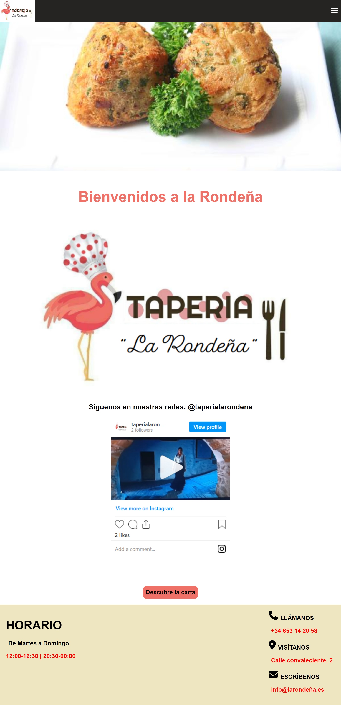

# Taperia la Rondeña


App de una taperia ficticia en el centro de Málaga.
Esta incluye formulario para contactar con la empresa así como un apartado para reservar mesa exterior y interior.
La vista reserva no utiliza ninguna libreria.
Los datos son alojados en firebase.

## Tabla de contenidos
- [Vista general](#vista-general)
  - [Enlace a la web](#enlace-a-la-web)
  - [Capturas en ordenador](#capturas-en-ordenador)
  - [Capturas en móvil](#capturas-en-móvil)
- [Desarrollo](#desarrollo)
  - [Tecnologías](#tecnologías)
  - [Reproducir en local](#reproducir-en-local)
- [Autor](#autor)
## Vista General
### Enlace a la web
Descubre Taperia La Rondeña en:
https://larondenia.netlify.app/

### Capturas en ordenador


### Capturas en móvil


## Desarrollo
### Tecnologías
- Maquetación: HTML5
- Estilos: CSS
- Funcionalidad: VueJS,
- Empaquetador: webpack
- Librerias: axios

### Reproducir en local
Clona el proyecto
```
  git clone https://github.com/geminway92/cultura-y-ocio-malaga.git
```
Entra en la carpeta
```
  cd taperia-larondenia
```
Instala las dependencias del proyecto
```
  npm install
```
Construye el proyecto
```
  npm run build
```
Inicia el proyecto en local
```
  npm run serve
```

## Autor
- [Gema Martín](https://github.com/geminway92)


